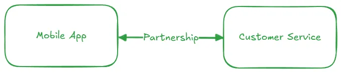
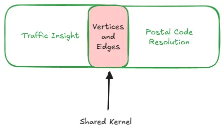

We have all heard about Anti-Corruption Layers, Open-Host, Separate Ways, Conformist etc etc, it just happens that on a day to day basis we are dealing with these abstractions while we might not be very conscious about them. In this post, I try to provide concrete examples of how these Bounded Context relationships are in play.

<!-- more -->
## Cooperation: It’s about us
Your team owns several bounded contexts, you and your teammates have chemistry and live by strong communication already. In a word, “your team just ‘gels’.’”,  then the relationship between those owned bounded contexts can be: Partnership or a Shared Kernel.

### Partnership: We have Zero Friction
The Partnership is a dynamic where tight collaboration is king: all sides are willing to do frequent  synchronization on adhoc topics and the feedback loop is short. There is clearly a tendency and need for communication overhead, in other words a culture of high-trust and high-communication is established.

The Partnership is more about the culture IMHO than a specific technical approach (such as design pattern) or an orientation towards overcommunication. In a real world partnership manifests itself when you and your teammate who own certain tightly integrated Bounded Contexts want to make some quick internal API contract changes, you sit together to hash out the design and pair-program to get the first successful CI out of the door.

As an example that really focuses on “tight collaboration”, consider a mobile app team that constantly works closely with customer service to apply user feedback into Mobile App UI.

### Shared Kernel: We cook in same kitchen, But make different Food

All graphs are a bunch of Vertices and Edges in the end, but when you apply different color codes to edges or group  specific nodes  together you start to build different abstractions on top of them. These new abstractions can be thought of as an example of cohesive Bounded Contexts which share a consistent model, or in other words, a Shared Kernel: Vertices and Edges.

From our graph example we can build the thought that a Shared Kernel is about preserving a shared contract (e.g. shared code, classes, or database schema) between different Bounded Contexts: if that contract changes, all Bounded Contexts using it are directly impacted, so a change must be carefully coordinated to avoid introducing regression.

Above image shows Shared Kernel relationship between two bounded contexts: Traffic Insight and Postal Code Resolution which depend on the same shared model of Vertices and Edges. As another example,  In the context of a financial trading platform, a shared library that takes over the concern of defining Money and Currency and converting currency can be an example of a Shared Kernel where two Bounded Contexts “Trading” and “Portfolio Management” would be used.

## Follow up: Customer Supplier
In the next post [Part II](blog/b-2025-08-24-social-life-software-bc-rel-p2.md), we will look at Customer Supplier Relationships: Conformist, Anticorruption Layer and Open-Host Service.

