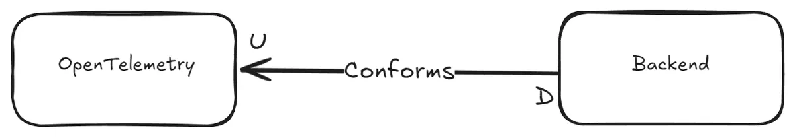
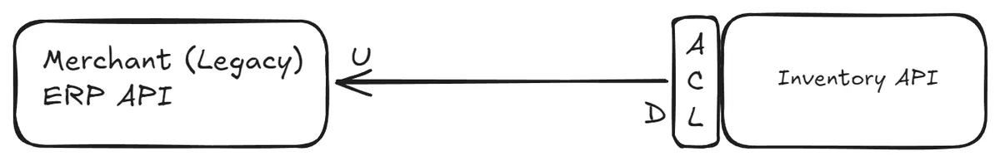
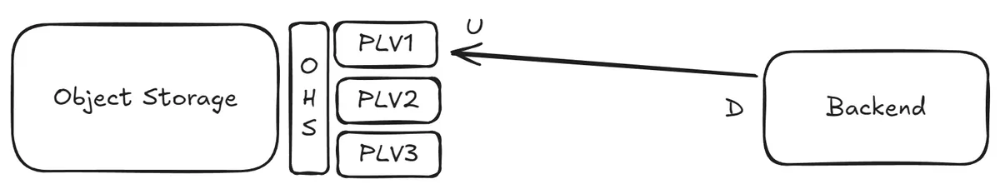
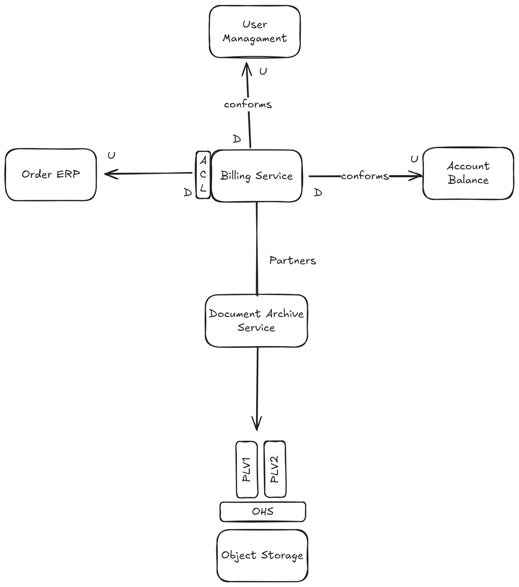

This is a follow-up post from [Part I](blog/b-2025-08-16-social-life-software-bc-rel-p1.md) where we looked into Cooperation relationship type between Bounded Contexts. This post will look into following topics:
* Customer-Supplier 
* Separate Ways
* Context Map

<!-- more -->

## Customer Supplier: Politics
A “Supplier” or “Upstream” bounded context is providing a service, and another “Customer” or “Downstream” bounded context is using that service. Usually this supplier is an API governed by a different or neighbouring team rather than one that your team owns and the power dynamic is uneven. You can make choices: Conformist, Anticorruption Layer orOpen-Host Service.

### Conformist: We surrender but relax on shoulders of giants

The upstream team does not really care about you, they do their own thing at their own speed. Usually this happens when you trust the upstream entity when you know they work for the greater good, which includes your interests. In this scenario, you recognize it’s worthwhile to give up a relatively significant part of your control in how things should run to that particular upstream team.

At some point in our career, we all had good and some unconventional ideas on how to get realtime insight into how the code we shipped to production performs. But hopefully today we have things like OpenTelemetry and standard suites of libraries for that goal. Nowadays, we prefer things like having Traces, Spans etc to monitor how call chains across neighbouring services including our application happen. This is one very clear example where we trust the standards, conform so to speak, and adopt well maintained tools and delegate the “How”.

Although in previous OpenTelemetry example some libraries fail to work after some time to send out Traces and Spans, we act on it in nonviolent manner, with upgrading or fixing dependencies for a greater cause: to go back to business and make some money.

### Anticorruption Layer: Gatekeeping
Federal states may form one country and adhere to the same constitution, but in the end, every state is its own kettle of fish. For example laws can differ from one state to the other when it comes to environment or property ownership disputes.

You can’t rely on the upstream team’s bounded context (coming from their own fully autonomous world) because they do things in a way that can’t work for you as-is. But you also can't ignore them, because they solve a critical problem. Your choice: Diplomacy.

From time-to-time, an upstream team is providing an OpenAPI contract of their REST API that every time you interact with it, you just laugh to yourself (the reasons are not important for us :D). During testing you realize the data do not change very often, say 12 hours, but the response time is absolutely proportional to the speed at which your elbow hairs grow. Therefore you decide to build a cache to mitigate that, and use that cache for quick lookup. You might even go one step further, you totally change the data model, so instead of making 2 calls to build a certain data model, you now make one call thanks to how you arranged the data in your cache.

Anti-corruption, the cache mechanism in our example, is the medium we  want to have to preserve our own environment by not exposing / leaking everything from the upstream bounded context to our beloved downstream bounded context: You want to preserve the language you speak within the boundaries of your downstream bounded context, The ubiquitous language if you recall, from external upstream’s idioms or terms (jokingly, a real life resemblance are German-only-speaking companies and English Speaking Expats :D).

### Open-host Service: Gentlemen’s Agreement
Finally, this last one is about upstream working with downstream consumers in mind. Upstream Bounded Context tells you about its contracts, but to avoid locking you in, it also publishes different versions of the same contract. It is up to you, the consumer, which version of the contract you want to be in relationship with upstream.

The way each contract is communicated apparently has a fitting name: Published Language. The medium by which the contracts are implemented or exposed by upstream Bounded Context is called “Open-Host Service”.  What happens in practice is that via Open Host Service medium the upstream Bounded Context decouples its own internal abstractions from those abstractions of “Published Language”. This helps the upstream to have full autonomy on how they want to run things on their end while they are not giving consumers hard times by unexpectedly breaking them, say by accidental service regression. Note that this is only possible by fully respecting the abstractions and assumptions in Published Language.

Consider a distributed object storage, which provides an API for reading and writing files in their entirety. Later on they add streaming capabilities, so you can get notified about gradual changes of a certain file. Instead of overnight changing their API, they publish a second version of their API that adds subscription functionality, while supporting previous file level API for clients who are used to the previous API. Also they do not necessarily expose their clients to learn about how they operate, where they store each file binary blob or how they distribute that file across their data centers (irrelevant to consumer’s concern) giving them full autonomy on how they want to change their infrastructure without breaking clients.

## Separate ways: Too costly
Sometimes you really cannot bear the cost. You had a good time starting “easy” with a specific cloud provider’s FaaS, but you then saw that runtime costs are eating up all your business profit margins, so you decide to go your separate ways, like DHH and AWS.

Separate ways pattern applies when you cannot make the case for an integration between two services provided by a certain bounded context aka “Not pragmatic”. Mainly because your rationale proves to you that it is: “Complicated and Costly”, “Polluting and Expensive”, “Vendor Lock-in” or even “Hard to Coordinate”.

So you decide to duplicate (or copy part of) that functionality of a specific upstream Bounded Context. For e.g. you built everything on top of a sexy FaaS and later on you got fed up with debugging cold-start problems of certain functions  by guesstimating certain optimal configuration values at 3:00 AM (as you gave up on their documentation (and support)). So then, you roll out your own Kubernetes cluster and deploy like never before, effectively deciding to build your own serverless infrastructure.

## Context Map
When you put all Bounded Contexts and the relationships between them on a  whiteboard or something similar, you get the Context Map. That is as simple as it gets. When you zoom out, sit back and blow into your hot coffee mug, you get a visual representation of how Conway’s Law applies to your organization.

The image below displays a context map for a Billing service. This service is responsible for creating billing documents for user orders. These documents include the most recent account balance and are ultimately stored in object storage by the Document Archive service.

